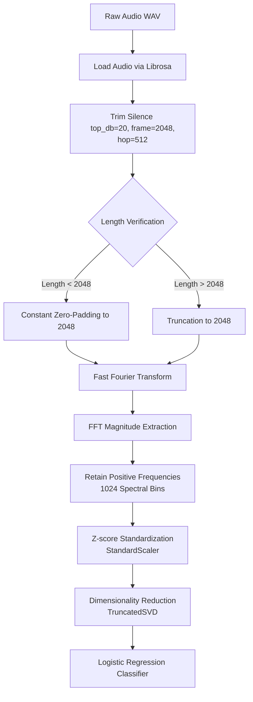

# Methods

This section describes the clinical cohort, data collection procedures, acoustic preprocessing steps, and the machine learning pipeline developed to differentiate between Adductor Laryngeal Dystonia (AdLD) and Muscle Tension Dysphonia (MTD).

## Study Cohort and Diagnostic Labels

The study cohort comprises $N = 29$ adult patients evaluated for voice disorders. The clinical diagnoses serve as the reference standard and were established through comprehensive clinical evaluations by a multidisciplinary team, including a fellowship-trained laryngologist and a speech-language pathologist specialized in voice disorders. 

The cohort is distributed across three distinct diagnostic categories:
1. **Adductor Laryngeal Dystonia (AdLD, $n = 9$):** A task-specific focal dystonia characterized by involuntary spasms of the laryngeal adductor muscles during speech.
2. **Muscle Tension Dysphonia with Lesions (MTDpos, $n = 10$):** Dysregulated, hyperfunctional laryngeal muscle activity accompanied by benign phonotraumatic vocal fold lesions (e.g., nodules, polyps, or cysts) identified via laryngoscopy or stroboscopy.
3. **Muscle Tension Dysphonia without Lesions (MTDneg, $n = 10$):** Hyperfunctional laryngeal muscle activity in the absence of vocal fold structural pathology or underlying neurological etiologies.

## Audio Acquisition Protocol

Acoustic recordings were obtained during routine clinical evaluations prior to the initiation of any therapeutic intervention (e.g., botulinum toxin injection or behavioral voice therapy). Speech stimuli were recorded in a quiet, low-ambient-noise environment using a SonaSpeech clinical workstation (Kay Pentax, Montvale, NJ, USA) at a native sampling rate (typically $48\text{ kHz}$). A professional-quality directional microphone (AKG) was positioned at a fixed distance of approximately $10\text{ cm}$ from the left corner of the speaker's mouth. For the standardized acoustic analysis, only the first sentence of the Rainbow Passage ("When the sunlight strikes raindrops in the air, they act as a prism and form a rainbow") was analyzed, produced in each patient's typical conversational voice.

## Signal Preprocessing and Feature Extraction

Raw audio waveforms were processed using Python's scientific computing ecosystem (primarily `librosa` and `numpy`) according to a uniform pipeline:

1. **Silence Trimming:** To isolate active phonation and remove uninformative silence at the beginning and end of recordings, a silence-trimming algorithm (`librosa.effects.trim`) was applied. The decibel threshold was set to $20\text{ dB}$ below the reference peak amplitude, utilizing a frame length of $2,048$ samples and a hop length of $512$ samples.
2. **Length Normalization:** To accommodate matrix-based computations and standard classification inputs, the trimmed time-domain signals were normalized to a uniform length of $2,048$ samples:
   - Waveforms shorter than $2,048$ samples were padded with zeros at the end (constant padding).
   - Waveforms longer than $2,048$ samples were truncated to the first $2,048$ samples.
3. **Spectral Transformation:** A Fast Fourier Transform (FFT) was computed on the normalized time-domain waveforms. The absolute value of the FFT output was computed to obtain the magnitude spectrum.
4. **Feature Dimensionality:** Since the magnitude spectrum of a real-valued signal is symmetric, only the positive frequencies (the first half of the magnitude spectrum, representing $1,024$ spectral bins) were retained. These $1,024$ magnitude values served as the raw feature representation for each patient recording.

## Machine Learning Pipeline

The classification model was implemented as a multi-stage pipeline using `scikit-learn`:

1. **Standardization:** The $1,024$ FFT magnitude features were standardized to zero mean and unit variance using `StandardScaler` to ensure that all spectral frequencies contribute equally to the downstream model.
2. **Dimensionality Reduction:** Singular Value Decomposition (SVD) via `TruncatedSVD` was applied to the standardized spectral matrix. SVD project the high-dimensional feature space into a lower-dimensional subspace of $K$ orthogonal components that maximize explained variance. The number of components $K$ was treated as a hyperparameter and optimized via cross-validation. SVD projection vectors were derived strictly from training data in each fold to prevent data leakage.
3. **Classification:** A regularized logistic regression model was trained on the SVD components. The model utilizes the **SAGA** solver, a stochastic average gradient descent variant that supports both L1 and L2 regularization, with a maximum limit of $10,000$ iterations to ensure convergence. The optimization was evaluated under two configurations:
   - **Multinomial (3-class):** Predicting the probability of all three diagnostic classes (`AdLD`, `MTDpos`, and `MTDneg`) simultaneously.
   - **Binary:** Differentiating a single target diagnosis (e.g., `AdLD` vs. `not_AdLD`) in a one-vs-rest configuration.

## Hyperparameter Optimization and Model Evaluation

To find the optimal configuration while mitigating the high risk of overfitting associated with the small sample size ($N = 29$), a grid search (`GridSearchCV`) was executed over the pipeline parameters.

### Hyperparameter Search Space

The search space evaluated $1,848$ unique combinations of pipeline hyperparameters:
- **SVD Components ($K$):** Integers ranging from $2$ to $29$ ($28$ candidates).
- **Inverse Regularization Strength ($C$):** $6$ logarithmically-spaced values from $10^{-4}$ to $10^{2}$ ($10^{-4}$, $10^{-2.8}$, $10^{-1.6}$, $10^{-0.4}$, $10^{0.8}$, $10^{2}$).
- **Elastic Net Mixing Ratio ($l_1\text{ ratio}$):** $11$ linearly-spaced values from $0.0$ to $1.0$ ($0.0$, $0.1$, ..., $1.0$). *Note: Under scikit-learn's default setting, the $l_1\text{ ratio}$ parameter is functionally inactive unless the penalty is explicitly set to `"elasticnet"`.*

### Cross-Validation Strategy

A **3-fold Stratified Cross-Validation** strategy (`StratifiedKFold`, `shuffle=True`, `random_state=42`) was implemented to evaluate generalization performance. Stratification ensures that each fold maintains a proportional representation of the diagnostic classes (approximately $3$ `AdLD`, $3-4$ `MTDpos`, and $3-4$ `MTDneg` cases per fold).

### Performance Metrics and Overfitting Check

Depending on the training mode, the grid search optimized one of the following target metrics:
- **Balanced Accuracy:** Calculated as the macro-average of recall across all classes, which prevents inflated performance estimates in the presence of class imbalance.
- **Sensitivity:** The true positive rate (recall) for the designated binary positive class.
- **Positive Predictive Value (PPV):** The precision for the designated binary positive class.

To assess model generalization and identify potential overfitting, the pipeline compared **same-data performance** (the score obtained by training and testing the final tuned model on the entire dataset) against **cross-validation performance** (the mean score obtained across the validation folds). A baseline chance performance was also calculated using class priors under a random prediction strategy to contextualize model performance.
